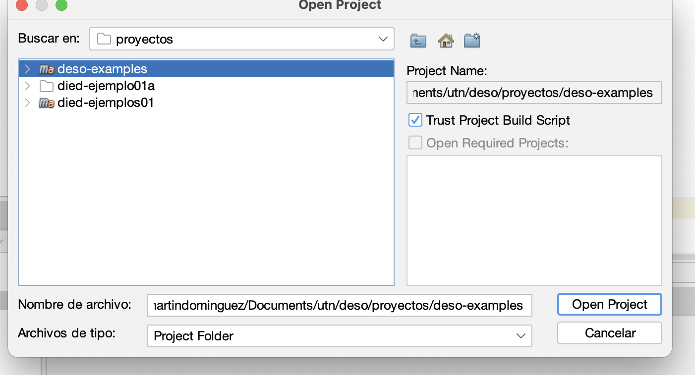
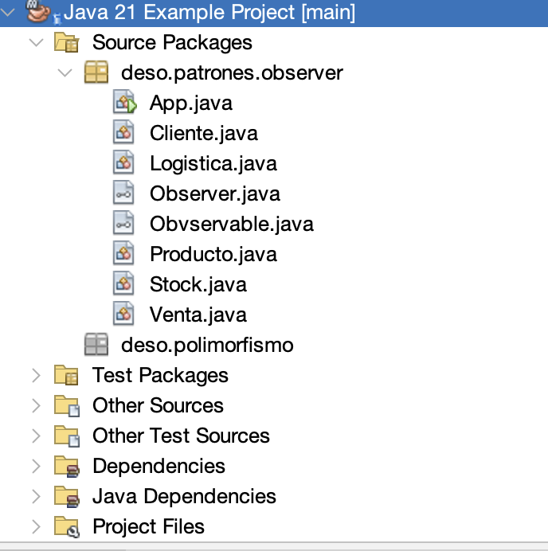

# deso-examples
Software Development Course - Example code

## How to download the project?
```
$ git clone https://github.com/mart-dominguez/deso-examples.git
$ cd deso-examples
````

Then got to deso-examples folder and run the command mvnw clean install

```
mvnw clean install
```

or in linux (make sure to make the file executable with chmod +x)
```
./mvnw clean install
```
## How to run it

mvnw exec:java -Dexec.mainClass="deso.patrones.observer.App"

## Using wit IDE
It could be used with either Netbeans / Visual Studio.





